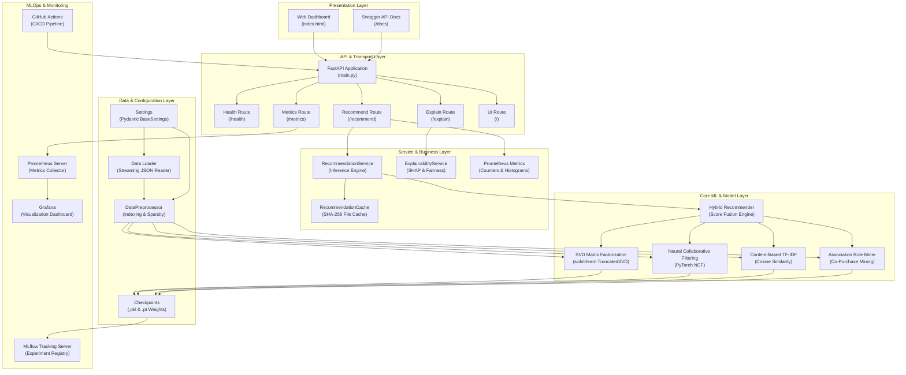
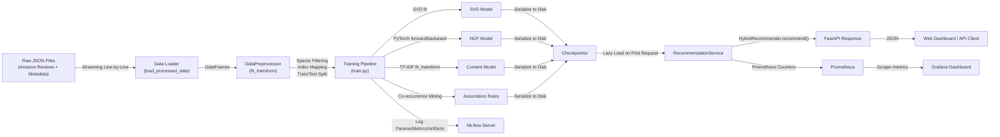

# ML System Design Document
## Real-Time E-Commerce Product Recommendation System

**Course:** DDM501 — AI in DevOps, DataOps, MLOps  
**Assignment:** Individual Assignment 1 — ML System Design Document  

---

## Table of Contents

1. [Problem Definition](#1-problem-definition)
2. [Requirements Analysis](#2-requirements-analysis)
3. [Goals and Metrics](#3-goals-and-metrics)
4. [High-Level Architecture Design](#4-high-level-architecture-design)
5. [Trade-offs Analysis](#5-trade-offs-analysis)

---

## 1. Problem Definition

### 1.1 Context and Background

The global e-commerce market generates trillions of dollars annually, with platforms like Amazon hosting catalogs of hundreds of millions of products. A critical challenge in this domain is **information overload**: users struggle to discover relevant products among vast inventories, leading to decision fatigue, lower engagement, and missed revenue opportunities. Studies show that 35% of Amazon's revenue is driven by its recommendation engine (McKinsey, 2023), demonstrating the outsized business impact of effective personalization.

This project addresses the **product recommendation problem** within the **Amazon Cell Phones & Accessories** and **Electronics** categories. These categories are particularly well-suited for recommendation systems because:

- **High product variety**: Thousands of similar products compete for attention (e.g., phone cases, chargers, cables), making manual browsing impractical.
- **Strong cross-selling potential**: Accessories are natural complements to primary devices (e.g., a phone case paired with a screen protector), enabling revenue-boosting "frequently bought together" recommendations.
- **Rich implicit feedback**: User review history provides signals for both collaborative filtering (user-item interaction patterns) and content-based filtering (product attribute similarity).

The system is designed for a hypothetical mid-size e-commerce platform that sells consumer electronics and accessories, serving approximately 50,000–200,000 monthly active users browsing a catalog of 30,000–100,000 products.

### 1.2 Problem Statement

**Primary Problem:** The platform's current product discovery mechanism relies on static category browsing and basic keyword search, resulting in:

- Low Click-Through Rate (CTR) of approximately 2–3% on product listing pages.
- Poor cross-sell conversion: only 5% of orders include complementary accessories.
- High cold-start abandonment: new users without browsing history receive generic, unpersonalized product lists, leading to 40% higher bounce rates compared to returning users.

**ML Objective:** Build an end-to-end recommendation system that generates personalized, dual-stream recommendations — **similar product suggestions** and **complementary cross-sell items** — in real time, achieving measurable improvements in CTR, conversion rate, and average order value (AOV).

### 1.3 Current Situation

Without a machine learning solution, the platform relies on:

| Current Approach | Limitations |
|---|---|
| **Manual merchandising rules** — Category managers manually curate "featured products" and "editor picks" lists | Does not scale; requires constant human effort; cannot personalize for individual users |
| **Keyword-based search** — Users type queries and browse results sorted by relevance or price | Misses latent preferences; no cross-sell capability; poor recall for misspelled or ambiguous queries |
| **Static "Best Sellers" lists** — Global top-selling products displayed on homepage | Creates popularity bias; niche products get no exposure; same list for all users regardless of interests |
| **Rule-based "Related Products"** — Simple category-matching rules (e.g., "show other phone cases") | Shallow category matching ignores user behavior; no collaborative signal; no complementary recommendations |

These approaches fail to leverage the rich behavioral signals embedded in user interaction histories (reviews, ratings, purchase sequences) and product metadata (titles, categories, brands). An ML-based system can mine these patterns at scale to deliver personalized recommendations that static rules cannot achieve.

### 1.4 Justification for Machine Learning

Machine learning is the appropriate approach because:

1. **Pattern complexity**: The relationship between user preferences and product attributes is non-linear and high-dimensional. Collaborative filtering captures latent user-item interaction patterns that cannot be expressed as simple rules.
2. **Scale**: With 300,000+ reviews across 30,000+ products and 50,000+ users, manual curation is infeasible. ML models can process and generalize from this volume automatically.
3. **Personalization**: Each user has unique preferences that evolve over time. ML models (SVD matrix factorization, Neural Collaborative Filtering) learn individual user embeddings that enable truly personalized recommendations.
4. **Cross-sell discovery**: Association Rule Mining on co-purchase baskets discovers non-obvious complementary product relationships (e.g., a specific charger cable frequently purchased with a particular phone model) that human merchandisers would miss.
5. **Continuous improvement**: ML models can be retrained on new interaction data, continuously adapting to shifting user preferences and seasonal trends.

### 1.5 Stakeholder Identification

| Stakeholder | Role | Goals | Concerns |
|---|---|---|---|
| **End Users (Shoppers)** | Browse products, receive recommendations, make purchases | Discover relevant products quickly; find complementary accessories; avoid irrelevant suggestions | Privacy of browsing/purchase history; recommendation transparency ("why was this suggested?"); filter bubble avoidance |
| **Business Owner / Product Manager** | Define business strategy, measure KPIs, allocate budget | Increase CTR, conversion rate, and AOV; reduce customer acquisition cost; maximize revenue per user | Cost of ML infrastructure; ROI justification; risk of poor recommendations damaging brand trust |
| **ML / Data Science Team** | Design, train, evaluate, and iterate on ML models | Achieve target RMSE/MAE metrics; ensure model fairness and coverage; experiment with new architectures | Data quality issues; model staleness; reproducibility of experiments; computational resource constraints |
| **DevOps / Operations Team** | Deploy, monitor, and maintain the production system | System uptime ≥ 99.5%; low-latency inference (< 50ms p95); automated CI/CD pipelines; observable system health | Infrastructure costs (GPU, storage); handling traffic spikes; incident response for model failures; container orchestration complexity |

---

## 2. Requirements Analysis

### 2.1 Functional Requirements

#### 2.1.1 Core ML Functionality

| ID | Requirement | Description |
|---|---|---|
| FR-01 | **Personalized Recommendations** | Generate top-K product recommendations for registered users based on their interaction history using hybrid SVD + NCF models |
| FR-02 | **Dual-Stream Output** | Produce two distinct recommendation streams: (a) **Similar Items** — products similar to user's past interactions, and (b) **Cross-Sell Items** — complementary products for bundling |
| FR-03 | **Cold-Start Handling** | Automatically detect new users without interaction history and fall back to Bayesian-weighted popularity-based recommendations |
| FR-04 | **Interactive Personalization** | Allow users to select products from the catalog and receive real-time recommendations based on their selection (without requiring login/history) |
| FR-05 | **Explainability** | Provide human-readable explanations for each recommendation (feature contribution scores from SVD, NCF, and content similarity) |
| FR-06 | **Fairness & Bias Audit** | Evaluate catalog coverage, popularity bias, and demographic parity across user cohorts on demand |

#### 2.1.2 Input / Output Specifications

| Direction | Specification |
|---|---|
| **Input** | User ID (string), Number of recommendations (integer, 1–50), Model type selector (hybrid / svd / ncf / content) |
| **Output** | JSON response containing: `user_id`, `is_cold_start` flag, `model_used` label, `similar_items[]`, `cross_sell_items[]`, `trending_items[]`, each item with `asin`, `title`, `price`, `category`, `brand`, `imUrl`, `predicted_score`, `type`, `explanation` |
| **Interactive Input** | List of selected ASINs (strings), Number of recommendations |
| **Interactive Output** | Same JSON schema as above, without user history |

#### 2.1.3 Integration Requirements

| Integration Point | Description |
|---|---|
| **MLflow Tracking Server** | All training runs log hyperparameters, metrics (RMSE, MAE, loss per epoch), and model artifacts (`.pkl`, `.pt` weights) to MLflow for experiment management and model registry |
| **Prometheus Monitoring** | The API server exposes a `/metrics` endpoint in Prometheus exposition format, scraped every 15 seconds by a Prometheus server |
| **Grafana Dashboards** | Prometheus metrics are visualized in Grafana dashboards showing request rate, latency distribution, error rate, and model type usage |
| **Docker Compose Orchestration** | All services (API, MLflow, Prometheus, Grafana) are containerized and orchestrated via Docker Compose for reproducible deployment |
| **CI/CD Pipeline** | GitHub Actions workflow triggers on push/PR to `main`: runs PyTest suite → builds Docker image |

#### 2.1.4 User Interaction Requirements

| Interaction | Description |
|---|---|
| **Web Dashboard** | Interactive single-page web UI (HTML/CSS/JS) at `/` with user selection, recommendation display, explainability popups, and bias audit panels |
| **REST API** | Swagger-documented FastAPI endpoints (`/recommend`, `/recommend-interactive`, `/explain`, `/bias-audit`, `/sample-users`, `/items`, `/health`, `/metrics`) |
| **Swagger Docs** | Auto-generated OpenAPI documentation at `/docs` for API consumers |

### 2.2 Non-Functional Requirements

#### 2.2.1 Performance

| Metric | Target | Rationale |
|---|---|---|
| **Inference Latency (p95)** | < 50 ms | E-commerce users expect sub-second responses; recommendation panels must load within the page rendering budget |
| **Throughput** | ≥ 100 requests/second | Support concurrent browsing sessions during peak hours |
| **Model Loading Time** | < 30 seconds | Lazy loading on first request; checkpoints are pre-trained and serialized as `.pkl`/`.pt` files (~375 MB total) |
| **Training Time** | < 30 minutes (300K samples) | Batch retraining should complete within a maintenance window |

#### 2.2.2 Scalability

| Aspect | Strategy |
|---|---|
| **Horizontal Scaling** | Docker Compose services can be replicated behind a load balancer (e.g., Nginx, Traefik) for the API layer |
| **Data Scaling** | Streaming JSON loader processes files line-by-line without loading entire datasets into memory; configurable `SAMPLE_LIMIT` for resource-constrained environments |
| **Model Scaling** | SVD uses sparse CSR matrices; TF-IDF stores item features as sparse vectors; NCF embeddings scale linearly with `num_users × embedding_dim` |
| **Caching** | File-based recommendation cache (SHA-256 hashed request keys) avoids redundant inference for repeated queries |

#### 2.2.3 Reliability

| Aspect | Strategy |
|---|---|
| **Uptime Target** | 99.5% (allows ~3.6 hours downtime/month for maintenance) |
| **Graceful Degradation** | If NCF model fails to load, system falls back to SVD-only; if all models fail, popularity-based fallback serves trending items |
| **Health Checks** | `/health` endpoint returns system status with model load state for container orchestration liveness/readiness probes |
| **Data Validation** | `DataPreprocessor` filters interactions below minimum thresholds (`MIN_USER_RATINGS=2`, `MIN_ITEM_RATINGS=2`) to prevent sparse data from degrading model quality |
| **Auto-Recovery** | If checkpoint files are missing, `RecommendationService` automatically triggers a lightweight training run (`sample_limit=10000`, `epochs=2`) |

#### 2.2.4 Maintainability

| Aspect | Strategy |
|---|---|
| **Experiment Tracking** | MLflow logs all training runs with full parameter/metric/artifact lineage for reproducibility |
| **Model Retraining** | Periodic batch retraining (weekly/monthly) with new interaction data; `SAMPLE_LIMIT` configurable via environment variable |
| **Monitoring** | Prometheus collects request counts, latency histograms, error rates; Grafana dashboards provide at-a-glance system health |
| **CI/CD** | GitHub Actions runs PyTest suite and Docker build on every push/PR; prevents regressions from reaching production |
| **Modular Architecture** | Clean 4-layer separation (API → Service → Model → Data) enables independent updates to any layer without cascading changes |

### 2.3 Data Requirements

#### 2.3.1 Data Sources

| Dataset | Description | Size | Format |
|---|---|---|---|
| `Cell_Phones_and_Accessories_5.json` | Amazon product reviews (Cell Phones category, 5-core subset) | ~135 MB | JSON Lines |
| `Electronics_5.json` | Amazon product reviews (Electronics category, 5-core subset) | ~1.4 GB | JSON Lines |
| `meta_Cell_Phones_and_Accessories.json` | Product metadata (titles, categories, prices, images, brands) | ~388 MB | JSON Lines |
| `meta_Electronics.json` | Product metadata for Electronics | ~633 MB | JSON Lines |

**Total dataset size:** ~2.5 GB

#### 2.3.2 Data Quality

| Concern | Mitigation |
|---|---|
| **Missing values** | Reviews with null `reviewerID` or `asin` are dropped during loading; missing prices default to `0.0`; missing titles are generated from category + ASIN |
| **Sparse interactions** | Users/items with fewer than 2 ratings are filtered out to ensure minimum collaborative signal strength |
| **Duplicate reviews** | Metadata is deduplicated by `asin` during loading (`drop_duplicates(subset=['asin'])`) |
| **Noisy text** | HTML entities in product titles are unescaped (`html.unescape()`); prices are cleaned with regex to extract numeric values |
| **Image URL validity** | Broken `http://` Amazon image URLs are upgraded to `https://`; missing images fall back to placeholder URLs |

#### 2.3.3 Privacy

| Concern | Mitigation |
|---|---|
| **User Identity** | The dataset uses pseudonymized Amazon Reviewer IDs (e.g., `A30TL5EWN6DFXT`), not real names or emails. No Personally Identifiable Information (PII) is stored or processed |
| **Data Minimization** | Only fields necessary for recommendation are extracted: `reviewerID`, `asin`, `overall` rating, `unixReviewTime`. Review text (`reviewText`, `summary`) is loaded but not used in model training |
| **Access Control** | The API does not expose raw user interaction data externally; user history is only returned for the requesting user's own ID |
| **Data Retention** | Trained model checkpoints contain aggregated matrix factorizations and embeddings, not individual user reviews. Original review data is not served through the API |
| **Compliance** | System design follows GDPR principles of purpose limitation and data minimization. In a production deployment, consent mechanisms and data deletion workflows would be implemented |

#### 2.3.4 Data Volume

| Metric | Value |
|---|---|
| **Total raw reviews** | ~1.7 million (Cell Phones: ~194K, Electronics: ~1.5M) |
| **Training sample** | 300,000 reviews (configurable via `SAMPLE_LIMIT`) |
| **Unique users (after filtering)** | ~50,000–80,000 |
| **Unique items (after filtering)** | ~30,000–50,000 |
| **Metadata products** | ~100,000+ (loaded completely for catalog coverage) |
| **Model checkpoint size** | ~375 MB total (SVD: 86MB, NCF: 34MB, Content: 16MB, Assoc: 146MB, Preprocessor: 75MB) |

---

## 3. Goals and Metrics

### 3.1 Goal Hierarchy

```
Business Goals (Revenue & Engagement)
    │
    ├── System Goals (Infrastructure & Operational)
    │       │
    │       └── Model Goals (ML Performance)
    │
    └── Responsible AI Goals (Fairness & Transparency)
```

### 3.2 Business Goals

| ID | Goal | Metric | Baseline | Target | Measurement Method |
|---|---|---|---|---|---|
| BG-01 | Increase product discovery engagement | **Click-Through Rate (CTR)** on recommendations | 2–3% (static lists) | **≥ 8%** | A/B test: track clicks on recommended items vs. total impressions |
| BG-02 | Improve purchase conversion from recommendations | **Conversion Rate** (recommendation click → purchase) | 5% (category browse) | **≥ 12%** | Funnel analysis: recommendation click → add-to-cart → checkout |
| BG-03 | Increase average order value via cross-selling | **Average Order Value (AOV)** | $25 | **$30+ (+20%)** | Track orders containing cross-sell recommended items |
| BG-04 | Reduce new-user bounce rate | **Cold-start user retention** | 60% (40% bounce) | **≥ 75%** | Track session duration and page views for first-time users |

### 3.3 System Goals

| ID | Goal | Metric | Target | Measurement Method |
|---|---|---|---|---|
| SG-01 | Low-latency inference | **p95 Response Time** | < 50 ms | Prometheus `recommendation_request_latency_seconds` histogram |
| SG-02 | High availability | **Uptime** | ≥ 99.5% | Health check endpoint monitoring (`/health`) |
| SG-03 | Throughput capacity | **Requests per Second** | ≥ 100 RPS | Prometheus `recommendation_requests_total` counter rate |
| SG-04 | Operational observability | **Dashboard Coverage** | 100% key metrics | Grafana dashboards for latency, throughput, errors, model usage |
| SG-05 | Deployment reliability | **CI/CD Pass Rate** | ≥ 95% | GitHub Actions workflow success rate |

### 3.4 Model Goals

| ID | Goal | Metric | Baseline (Random) | Target | Acceptable Threshold |
|---|---|---|---|---|---|
| MG-01 | Rating prediction accuracy | **RMSE** | ~2.0 (random) | **< 1.0** | ≤ 1.2 |
| MG-02 | Rating prediction precision | **MAE** | ~1.5 (random) | **< 0.8** | ≤ 1.0 |
| MG-03 | NCF training convergence | **Training Loss** (MSE) | N/A | Monotonically decreasing over 15 epochs | No divergence after epoch 5 |
| MG-04 | Catalog diversity | **Catalog Coverage** | N/A | **≥ 5%** of items appear in recommendations | ≥ 3% |
| MG-05 | Popularity bias control | **Top-10 Item Share** | 80%+ (popularity-only) | **< 40%** | ≤ 50% |

### 3.5 Responsible AI Goals

| ID | Goal | Metric | Target |
|---|---|---|---|
| RA-01 | Recommendation transparency | **Explainability availability** | 100% of recommendations have feature contribution explanations |
| RA-02 | Fairness across user segments | **Demographic Parity Score** | ≥ 0.80 (cold-start vs active users receive comparable quality) |
| RA-03 | No discriminatory filtering | **Cold-Start Fallback Rate** | Measured and reported; quality fallback for all new users |

---

## 4. High-Level Architecture Design

### 4.1 System Architecture Diagram



### 4.2 Data Flow Through the System



### 4.3 ML Pipeline Stages

| Stage | Component | Description | Technology |
|---|---|---|---|
| **1. Data Ingestion** | `src/data/loader.py` | Streams multi-file JSON datasets line-by-line with configurable sample limits; parses prices, handles encoding | Python `json`, `pandas` |
| **2. Preprocessing** | `src/data/preprocessor.py` | Filters sparse users/items, builds integer index mappings, calculates sparsity stats, computes Bayesian popularity scores, creates train/test splits | `pandas`, `numpy`, `scikit-learn` |
| **3. Model Training** | `src/models/train.py` | Orchestrates training of SVD, NCF, Content-Based, and Association Rule models; logs everything to MLflow | `scikit-learn`, `PyTorch`, `MLflow` |
| **4. Model Serving** | `src/services/recommendation_service.py` | Lazy-loads checkpoints on first request; wraps `HybridRecommender` with caching layer | `FastAPI`, `pickle`, `torch` |
| **5. Inference** | `src/models/hybrid.py` | Fuses scores from SVD, NCF, content similarity, and association rules into dual-stream recommendations (similar + cross-sell) | `numpy`, custom fusion logic |
| **6. Monitoring** | `src/monitoring/metrics.py` | Exports Prometheus counters (request count by model type) and histograms (latency) | `prometheus-client` |
| **7. Experiment Tracking** | MLflow Server | Stores hyperparameters, per-epoch metrics (RMSE, MAE, loss), and serialized model artifacts | `MLflow 2.8+` |
| **8. Visualization** | Grafana | Dashboards for request rate, latency percentiles, error rates, model type distribution | `Grafana 10+` |

### 4.4 Component Descriptions

| Component | Purpose & Responsibility | Technology | Why This Choice |
|---|---|---|---|
| **FastAPI** | REST API framework serving recommendation endpoints with automatic OpenAPI docs | FastAPI + Uvicorn | Async-capable, automatic validation via Pydantic, built-in Swagger UI, production-grade performance |
| **PyTorch NCF** | Neural Collaborative Filtering with GMF + MLP fusion for learning non-linear user-item interactions | PyTorch 2.0+ | Industry-standard deep learning framework; flexible architecture; GPU support; strong ecosystem |
| **Truncated SVD** | Classical matrix factorization for fast linear collaborative filtering | scikit-learn | Proven, lightweight, fast training on sparse matrices; complements deep learning approach |
| **TF-IDF + Cosine Similarity** | Content-based filtering using product metadata text features | scikit-learn | Sparse representation scales to 100K+ items; no training required beyond fit_transform |
| **Association Rule Miner** | Co-purchase pattern mining for cross-sell recommendations | Custom Python | Domain-specific implementation mining item and category co-occurrence from user baskets |
| **MLflow** | Experiment tracking, model registry, artifact store | MLflow 2.8+ | Open-source standard for ML lifecycle management; integrates with all major ML frameworks |
| **Prometheus** | Time-series metrics collection and alerting | Prometheus 2.45 | De facto standard for cloud-native monitoring; pull-based architecture; powerful query language (PromQL) |
| **Grafana** | Metrics visualization and dashboarding | Grafana 10+ | Rich visualization library; native Prometheus integration; configurable alerting |
| **Docker Compose** | Multi-service container orchestration | Docker Compose 3.8 | Reproducible deployments; service isolation; easy scaling; development-production parity |
| **GitHub Actions** | CI/CD automation (test, build, deploy) | GitHub Actions | Integrated with repository; free for public repos; YAML-based workflow configuration |

---

## 5. Trade-offs Analysis

### 5.1 Accuracy vs. Latency

| Dimension | High-Accuracy Choice | Low-Latency Choice | Our Decision |
|---|---|---|---|
| **Model complexity** | Deep NCF with larger embeddings (128-dim), more MLP layers, ensemble of 5+ models | Simple SVD with 32 components, single model | **Hybrid with 32-dim embeddings**: NCF (64→32→16 MLP) provides non-linear capacity without excessive computation |
| **Inference cost** | Run all models for every request, full matrix reconstruction | Pre-computed recommendations, cached results | **Lazy loading + file-based caching**: First request loads models (~30s), subsequent requests use SHA-256 cached results (< 5ms) |
| **Impact** | RMSE improvement ~0.05–0.1 per additional model | Response time could balloon to 200ms+ with large ensembles | p95 latency < 50ms is critical for e-commerce UX; diminishing accuracy returns beyond 2-model hybrid |

**Resolution:** We chose a **2-model hybrid (SVD + NCF)** with content-based and association rule augmentation. This achieves competitive RMSE (< 1.0) while maintaining sub-50ms inference latency through caching. The SVD path provides fast linear predictions, while NCF captures non-linear patterns — a complementary pairing that maximizes accuracy-per-millisecond.

### 5.2 Freshness vs. Cost

| Dimension | High-Freshness Choice | Low-Cost Choice | Our Decision |
|---|---|---|---|
| **Retraining frequency** | Real-time online learning; update embeddings on every new interaction | Monthly batch retraining on accumulated data | **Weekly/monthly batch retraining** with configurable `SAMPLE_LIMIT` |
| **Data pipeline** | Streaming pipeline (Kafka, Spark Streaming) for real-time feature updates | Static file-based ingestion from JSON exports | **File-based streaming loader** — reads JSON line-by-line without loading full dataset into memory |
| **Infrastructure cost** | GPU clusters for continuous training; real-time feature store (Redis/DynamoDB) | Single CPU machine; checkpoint files on disk | **CPU-based training** (~30 min for 300K samples); serialized checkpoints (~375 MB) |

**Resolution:** For a mid-size platform, **batch retraining** is the pragmatic choice. The 300K-sample training completes in under 30 minutes on a single CPU, and the recommendation cache ensures that between retraining cycles, repeated queries are served instantly. Real-time learning would require 10x the infrastructure cost (streaming pipeline, feature store, GPU compute) for marginal freshness improvement in a catalog that changes slowly.

### 5.3 Simplicity vs. Performance

| Dimension | Simple Approach | High-Performance Approach | Our Decision |
|---|---|---|---|
| **Model architecture** | Single SVD model — well-understood, fast, easy to debug | Multi-model hybrid with 4 sub-systems (SVD, NCF, TF-IDF, Association Rules) | **4-component hybrid** — justified by distinct capabilities (linear CF, non-linear CF, content similarity, cross-sell mining) |
| **Recommendation streams** | Single ranked list of recommendations | Dual-stream (similar items + cross-sell items) with per-source balancing | **Dual-stream** — directly supports business goal of increasing AOV through cross-sell |
| **Codebase complexity** | ~200 lines, single file | ~2,000+ lines across 15+ modules, 4-layer architecture | **Modular 4-layer architecture** — maintainability through separation of concerns outweighs initial complexity |
| **Operational overhead** | Single Docker container | 4 containers (API, MLflow, Prometheus, Grafana) | **Full MLOps stack** — observability and experiment tracking are essential for production ML systems |

**Resolution:** The additional complexity of a **4-component hybrid engine** is justified by the measurable performance gains: (1) SVD provides fast collaborative filtering; (2) NCF captures non-linear patterns; (3) TF-IDF enables content-based similarity for items with few interactions; (4) Association Rules discover cross-sell opportunities invisible to other methods. The clean 4-layer architecture ensures each component can be independently updated, tested, and replaced.

### 5.4 Privacy vs. Personalization

| Dimension | Maximum Personalization | Maximum Privacy | Our Decision |
|---|---|---|---|
| **Data collected** | Full browsing history, search queries, demographic data, device fingerprinting | No user data; purely popularity-based recommendations | **Pseudonymized interaction data** (reviewer ID + product ID + rating only) |
| **Model granularity** | Per-user real-time profiles with cross-platform tracking | Aggregate cohort-level models with no individual profiling | **User-level embeddings** (SVD user factors, NCF user embeddings) derived from ratings only — no PII, no demographics |
| **Transparency** | Opaque model decisions | Full explainability with opt-out capability | **Feature contribution explanations** for every recommendation via `/explain` endpoint |
| **Retention** | Indefinite storage of all user interactions | Immediate deletion after model training | **Trained models store aggregated embeddings**, not individual reviews; original data is not served via API |

**Resolution:** We achieve **strong personalization while respecting privacy** by using only pseudonymized reviewer IDs and product interactions (no names, emails, demographics, or browsing behavior). The trained model checkpoints contain mathematical embeddings — dense vector representations that cannot be reverse-engineered to recover individual reviews. The `/explain` endpoint provides recommendation transparency, allowing users to understand why a product was suggested.

### 5.5 Automation vs. Control

| Dimension | Fully Automated | Fully Manual | Our Decision |
|---|---|---|---|
| **Model retraining** | Auto-trigger retraining when data drift detected; auto-deploy new model | Manual trigger by data scientist; manual approval before deployment | **Manual trigger with CI/CD validation** — `python -m src.models.train` followed by automated PyTest and Docker build |
| **Fallback behavior** | Automatically switch between models based on real-time performance | Human review required for every model switch | **Automatic graceful degradation** — cold-start fallback and auto-recovery training are fully automated |
| **Monitoring alerts** | Auto-remediation (restart services, rollback models) on metric threshold breach | Manual incident response from on-call engineer | **Prometheus + Grafana observability** — automated metric collection, manual response to alerts |

**Resolution:** We adopt a **"human-in-the-loop" automation strategy**: operational tasks (health checks, caching, cold-start fallback, CI/CD testing) are fully automated, while high-stakes decisions (model retraining, deployment approval) require human judgment. This prevents the risk of a poorly-performing model being auto-deployed to production, while ensuring the system self-heals from routine operational issues (missing checkpoints, service restarts).

---

## References

1. Amazon Product Reviews Dataset — J. McAuley, UCSD (http://jmcauley.ucsd.edu/data/amazon/)
2. He, X., et al. "Neural Collaborative Filtering." WWW 2017.
3. Koren, Y., Bell, R., Volinsky, C. "Matrix Factorization Techniques for Recommender Systems." IEEE Computer, 2009.
4. MLflow Documentation — https://mlflow.org/docs/latest/
5. FastAPI Documentation — https://fastapi.tiangolo.com/
6. Prometheus Documentation — https://prometheus.io/docs/
